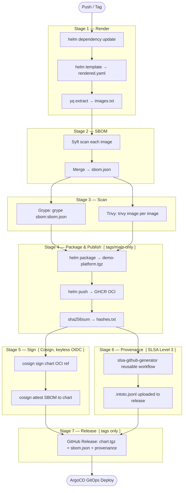

# fishcake-factory 🐟

A **production-grade reference repository** demonstrating a secure Kubernetes platform supply chain.

This repository shows how to assemble a Kubernetes platform from third-party Helm charts and secure it end-to-end using SBOMs, vulnerability scanning, artifact signing, and provenance — all in a single opinionated pipeline.

---

## Table of Contents

1. [Platform Composition](#1-platform-composition)
2. [Why Rendered Manifests Are the Source of Truth](#2-why-rendered-manifests-are-the-source-of-truth)
3. [SBOM Generation Strategy](#3-sbom-generation-strategy)
4. [SBOM vs Scanning vs Signing vs Provenance](#4-sbom-vs-scanning-vs-signing-vs-provenance)
5. [Why Both Cosign and SLSA?](#5-why-both-cosign-and-slsa)
6. [Pipeline Walkthrough](#6-pipeline-walkthrough)
7. [ArgoCD Deployment](#7-argocd-deployment)
8. [Repository Structure](#8-repository-structure)
9. [Local Usage](#9-local-usage)

---

## 1. Platform Composition

The platform is a **single versioned release unit** composed of three upstream Bitnami Helm charts, bundled as a Helm umbrella chart at `charts/demo-platform/`.

| Component | Role | Chart |
|-----------|------|-------|
| **nginx** | Web entry point / reverse proxy | `bitnami/nginx ~15.0.0` |
| **postgresql** | Relational database | `bitnami/postgresql ~13.0.0` |
| **redis** | Cache / session store (optional) | `bitnami/redis ~19.0.0` |

### Helm Dependency Model

```
charts/demo-platform/
├── Chart.yaml          ← declares bitnami sub-charts as dependencies
├── values.yaml         ← platform-wide defaults (including global.imageRegistry)
└── templates/          ← minimal platform templates (namespace, helpers)
```

All sub-chart images are configurable via Helm values and respect a `global.imageRegistry` override for air-gapped or mirrored environments:

```yaml
global:
  imageRegistry: "registry.internal.example.com"
```

To resolve dependencies locally:

```bash
helm dependency update ./charts/demo-platform
```

---

## 2. Why Rendered Manifests Are the Source of Truth

Values files alone cannot tell you which container images will actually be deployed. Image references can be:

- Overridden via `global.imageRegistry`
- Aliased or conditionally set by sub-chart logic
- Tagged differently depending on the chart version resolved

**The rendered manifest is the ground truth.** After `helm template`, every `image:` field reflects exactly what Kubernetes will pull:

```bash
helm template demo ./charts/demo-platform \
  -f values/values-prod.yaml > rendered.yaml
```

Images are then extracted from `rendered.yaml` — not from `values.yaml` — using `yq`:

```bash
yq '.. | .image? // empty' rendered.yaml | sort -u > images.txt
```

This `images.txt` file **defines the runtime contents of the platform release**.

---

## 3. SBOM Generation Strategy

An **SBOM (Software Bill of Materials)** is a complete inventory of every software component — libraries, packages, OS packages — inside the platform images.

**Tool: [Syft](https://github.com/anchore/syft)** — chosen because it:
- Scans OCI images directly from the registry
- Produces SPDX JSON (an open, machine-readable standard)
- Integrates natively with Grype for vulnerability scanning

### Process

```bash
# For each image in images.txt, generate an SPDX-JSON SBOM
for image in $(cat images.txt); do
  syft "$image" -o spdx-json >> sbom-parts/
done

# Merge into a single platform-level sbom.json
./supply-chain/sbom.sh images.txt sbom.json
```

The resulting `sbom.json` represents the **entire platform release** as a single scannable document.

---

## 4. SBOM vs Scanning vs Signing vs Provenance

These four concepts solve different problems and must not be confused:

| Concept | Question answered | Tool | Output |
|---------|------------------|------|--------|
| **SBOM** | *What is inside the platform?* | Syft | `sbom.json` (SPDX) |
| **Scanning** | *Is it safe to run?* | Grype + Trivy | Vulnerability report |
| **Signing** | *Can I trust this artifact?* | Cosign | OCI signature / signature blob |
| **Provenance** | *How was it built?* | SLSA Generator | `.intoto.jsonl` attestation |

### SBOM — What is inside

A machine-readable list of every package, library, and OS component in the platform images. Enables downstream consumers to audit dependencies without pulling images.

### Scanning — Is it safe

Two scanners with complementary roles:

- **Grype** (`grype sbom:sbom.json`) — SBOM-aware, dependency-level scan. Fast and CI-friendly. Uses the SBOM as its input, so it validates the *known* dependency tree.
- **Trivy** (`trivy image <image>`) — Direct image layer scan with a different vulnerability database. Provides a second opinion and catches OS-level vulnerabilities.

Pipeline rule: **CRITICAL vulnerabilities always fail the pipeline.** HIGH severity is configurable via the `FAIL_ON_HIGH` repository variable.

### Signing — Can I trust it

Cosign signs OCI artifacts using **keyless OIDC** — no long-lived keys required. The signature is bound to the GitHub Actions workflow identity and stored in the public Sigstore transparency log (Rekor). Consumers can verify with:

```bash
cosign verify ghcr.io/h3ow3d/charts/demo-platform:<version>
```

### Provenance — How was it built

The SLSA provenance record answers: which repo, which commit, which workflow run, and which inputs produced this artifact. Generated by `slsa-github-generator` in an isolated build environment.

---

## 5. Why Both Cosign and SLSA?

They serve **different, non-overlapping purposes**:

| | Cosign | SLSA Generator |
|-|--------|----------------|
| **Purpose** | Signs artifacts (integrity + authenticity) | Records build provenance |
| **Output** | OCI signature / attestation | `.intoto.jsonl` provenance |
| **Answers** | "Was this tampered with?" | "How was this built?" |
| **Stores** | OCI registry (alongside artifact) | GitHub release + OCI |
| **Verification** | `cosign verify` | `slsa-verifier` |

Using one without the other leaves a gap:
- Cosign alone can't prove *where* the artifact was built.
- SLSA alone doesn't prevent someone from swapping the artifact after the provenance was recorded.

Together they provide a complete chain of custody.

---

## 6. Pipeline Walkthrough



### Key pipeline design decisions

- **Images extracted from rendered manifests** — not from values files.
- **Grype scans the SBOM** — fast, cache-friendly, SBOM-aware.
- **Trivy scans live images** — second opinion with a different vulnerability database.
- **Cosign signs the OCI chart ref** (digest-pinned) — tamper-proof.
- **SLSA runs as an isolated reusable workflow** — its own OIDC identity, cannot be spoofed by the calling workflow.
- **Publish steps only run on `main` or version tags** — PRs only trigger render + SBOM + scan.

---

## 7. ArgoCD Deployment

The platform is deployed via ArgoCD in a GitOps pattern:

```
argocd/application.yaml  →  OCI registry (GHCR)  →  Kubernetes cluster
```

ArgoCD pulls the versioned chart directly from the OCI registry — no separate Helm repo server required.

```yaml
source:
  repoURL: oci://ghcr.io/h3ow3d/charts
  chart: demo-platform
  targetRevision: "0.1.0"
  helm:
    valueFiles:
      - values-prod.yaml
```

**To deploy a new version:**

1. Merge to `main` or push a version tag (`v0.2.0`)
2. Pipeline publishes new chart to GHCR, signs it, generates provenance
3. Update `targetRevision` in `argocd/application.yaml` and commit
4. ArgoCD detects the change and rolls out the new version

**To verify the chart before deploying:**

```bash
# Verify the Cosign signature
cosign verify ghcr.io/h3ow3d/charts/demo-platform:0.1.0

# Verify the SBOM attestation is attached
cosign verify-attestation --type spdx ghcr.io/h3ow3d/charts/demo-platform:0.1.0

# Verify SLSA provenance
slsa-verifier verify-artifact demo-platform-0.1.0.tgz \
  --provenance-path demo-platform-0.1.0.tgz.intoto.jsonl \
  --source-uri github.com/h3ow3d/fishcake-factory
```

---

## 8. Repository Structure

```
fishcake-factory/
│
├── charts/
│   └── demo-platform/          ← Helm umbrella chart
│       ├── Chart.yaml          ← chart metadata + bitnami dependencies
│       ├── values.yaml         ← platform-wide defaults
│       └── templates/          ← namespace, helpers, NOTES
│
├── values/
│   ├── values-dev.yaml         ← low-resource dev environment overrides
│   └── values-prod.yaml        ← production-grade overrides
│
├── supply-chain/
│   ├── extract-images.sh       ← extract images from rendered.yaml using yq
│   ├── sbom.sh                 ← generate platform SBOM with Syft
│   └── scan.sh                 ← vulnerability scan with Grype + Trivy
│
├── .github/
│   └── workflows/
│       └── pipeline.yml        ← full supply chain pipeline
│
├── argocd/
│   └── application.yaml        ← ArgoCD Application (OCI chart source)
│
└── README.md
```

---

## 9. Local Usage

### Prerequisites

| Tool | Version | Purpose |
|------|---------|---------|
| `helm` | ≥ 3.14 | Chart management |
| `yq` | ≥ 4.x (mikefarah) | YAML query |
| `syft` | ≥ 1.x | SBOM generation |
| `grype` | ≥ 0.78 | SBOM-based vulnerability scan |
| `trivy` | ≥ 0.50 | Image-based vulnerability scan |
| `cosign` | ≥ 2.x | Artifact signing |

### Step-by-step

```bash
# 1. Clone and enter the repo
git clone https://github.com/h3ow3d/fishcake-factory
cd fishcake-factory

# 2. Resolve Helm dependencies
helm dependency update ./charts/demo-platform

# 3. Render platform manifests
helm template demo ./charts/demo-platform \
  -f values/values-prod.yaml > rendered.yaml

# 4. Extract container images (source of truth)
./supply-chain/extract-images.sh rendered.yaml images.txt

# 5. Generate platform SBOM
./supply-chain/sbom.sh images.txt sbom.json

# 6. Run vulnerability scans
./supply-chain/scan.sh images.txt sbom.json

# 7. Package the chart
helm package ./charts/demo-platform
```

### Configuration

| Variable | Default | Description |
|----------|---------|-------------|
| `FAIL_ON_HIGH` | `false` | Set to `true` to fail pipeline on HIGH CVEs |
| `global.imageRegistry` | `""` | Override image registry for air-gapped environments |

---

## License

MIT